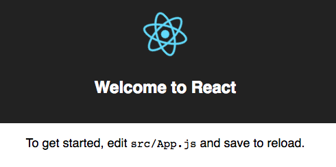
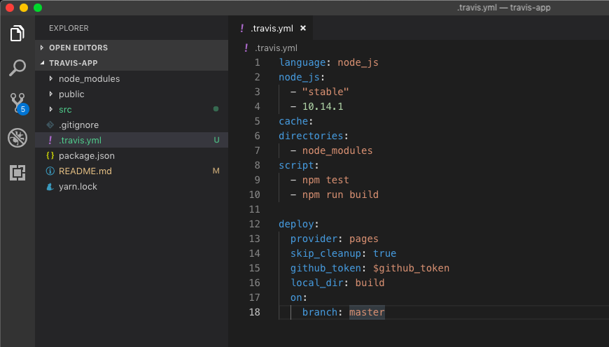
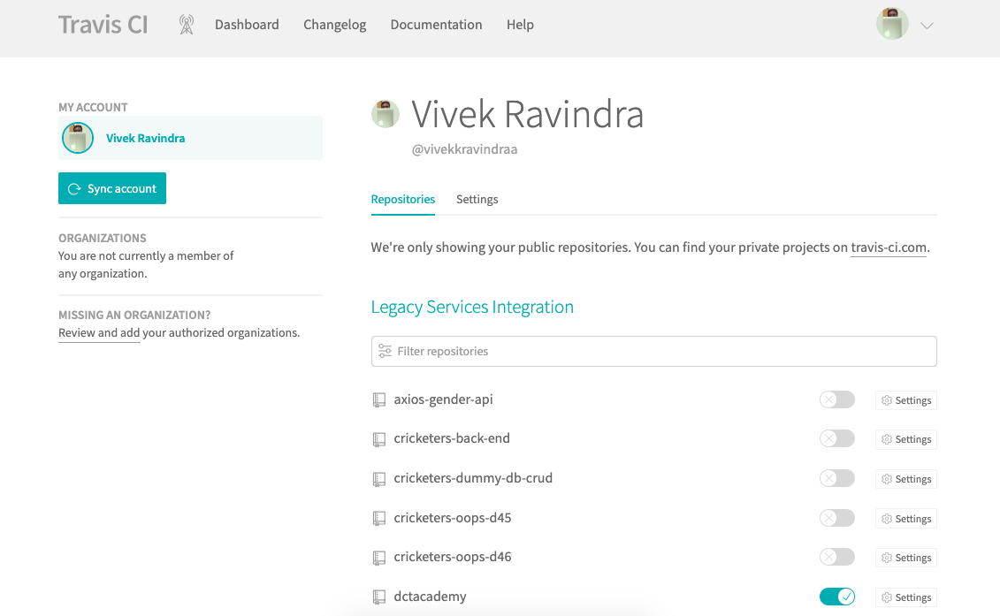
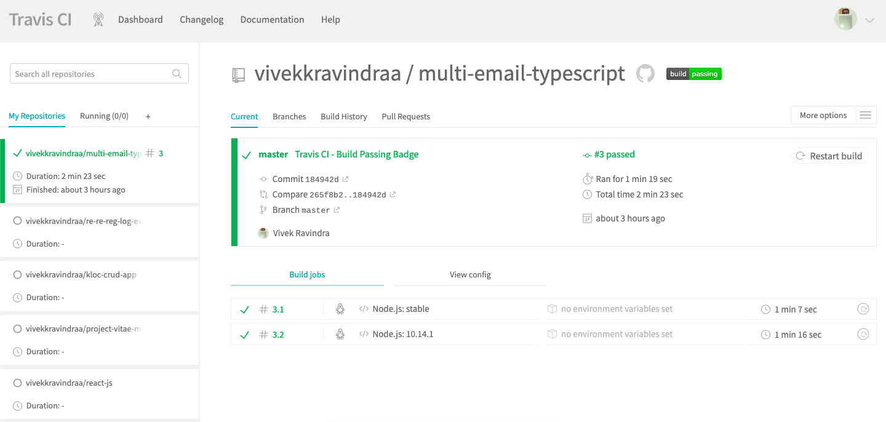
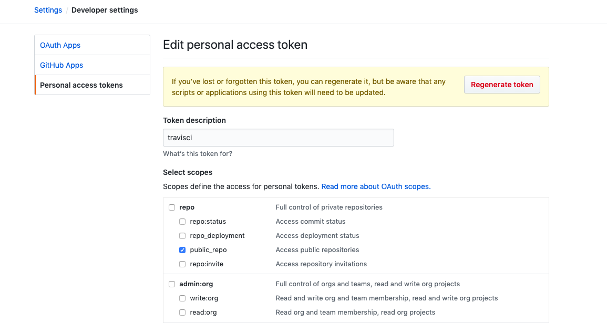
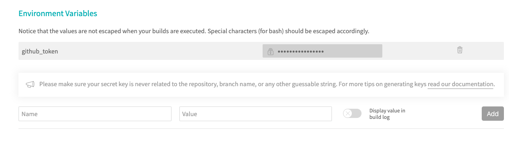
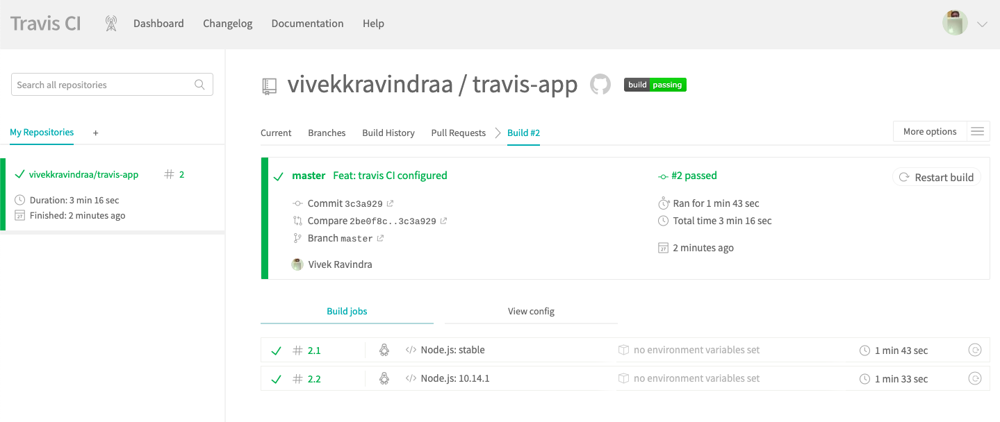
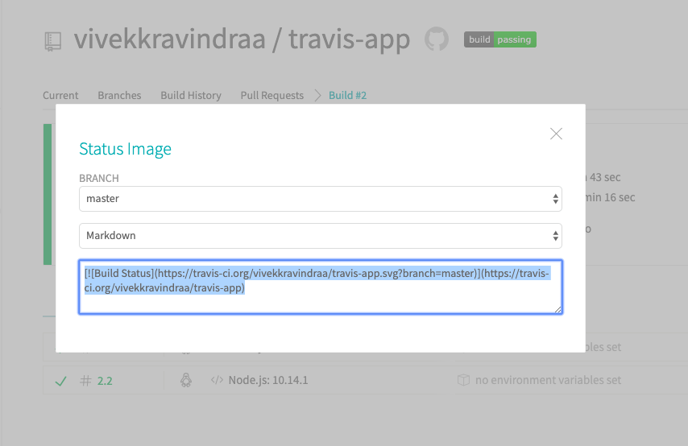
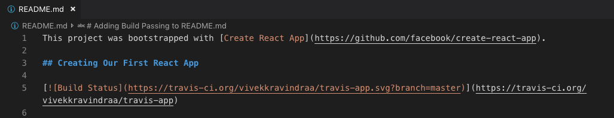

This project was bootstrapped with [Create React App](https://github.com/facebook/create-react-app).

## Creating Our First React App

[](https://travis-ci.org/vivekkravindraa/travis-app)

First, start off by moving into wherever you want to develop your application. In that directory, we’re going to create an app called “travis-app”:

```javascript
$ npx create-react-app travis-app
```

```javascript
$ cd travis-app
```

```javascript
$ npm start
```

This will start up a little development web server and give you a place to start working on your application. Running this will start up a development server at http://localhost:3000/ and give you a nice little starter template:



Reference CLIs:

```javascript
$ npm run build
```

```javascript
$ npm test
```
:skull: :warning: :no_entry_sign: :x:
```javascript
$ npm run eject
```

## Setting up Continuous Integration Builds

First, make sure your react project is pushed into the GitHub and you have an account in Travis CI.

The very first step in integrating Travis CI is to create a file named <b>.travis.yml</b> which will contain the essential information about the environment and configurations for the build to run.

We will have to include the programming language and its version. In our project, version will be set to <b>stable</b> and also the locally installed node version will be mentioned.

You can check by your current node version by running <code>node -v</code>.

The final contents of the file <b>.travis.yml</b> will be as follows:

<b>/.travis.yml</b>

```ruby
language: node_js
node_js:
    - "stable"
    - 10.14.1
cache:
    directories:
        - node_modules
    script:
        - npm test
        - npm run build
```

We will add this file in our project root folder like this and push it to our github repository.



In order to make this build file working, we need to link up our project to Travis. For that, we can go to our logged in account in Travis.



And then click the <b>+</b> icon near to the My Repositories which will open a new window.



Then toggle the settings to enable the project. It will start the build process.

## Setting up auto deployment to GitHub Pages

In order to deploy to the github pages, we need to provide access-token to our build file. To obtain a new access-token we can go to:

<b>GitHub Profile > Settings > Developer Settings > Personal Access Tokens</b>

Add Token Description - ex: travisci

Select Scopes - About permission, we need repo level access.

And click on Update / Generate the token.



Copy the value of this token. This is a private token that gives access to your GitHub repos.

Now we can go to our project build screen. Then navigate to the settings page and add the environment variables and paste the copied token as its value. Here I have named my variable as github_token.



To make our deployment work we need to add deployment script in our .travis.yml. Now, let's add it.

<b>/.travis.yml</b>

```ruby
language: node_js
node_js:
    - "stable"
cache:
directories:
    - node_modules
script:
    - npm test
    - npm run build

deploy:
    provider: pages
    skip_cleanup: true
    github_token: $github_token
    local_dir: build
    on:
        branch: master
```

Here, $github_token will read the access token value from our environment variables that we set previously.

We need to let our app know which URL that it should look for. We can set the URL in our app package.json. In my case, it goes like..

```javascript
{
    "name": "travis-app",
    "version": "0.1.0",
    "private": true,
    "homepage": "https://vivekkravindraa.github.io/travis-app/",
    "dependencies": {
        ........
    }, 
    ....
}
```

It could vary on others but the format is like this.

    https://<usename>.github.io/<repository_name>/

Now, we can commit and push our changes to our repo in Github. It will automatically trigger the build. After successful completion of our build, it will deploy our project into the gh-pages.

Thus resulting our app running in the URL which in my case is:

    travis-app

    vivekkravindraa.github.io



## Adding build passing to README.md

Click on the build passing image beside repo and mention the Markdown in the dropdown.

Copy the URL generated for the build passing and paste it in README.md!





That gets the job done!

##### Vivek Ravindra :neckbeard: :bowtie: :octocat:


:copyright: :registered: :tm: