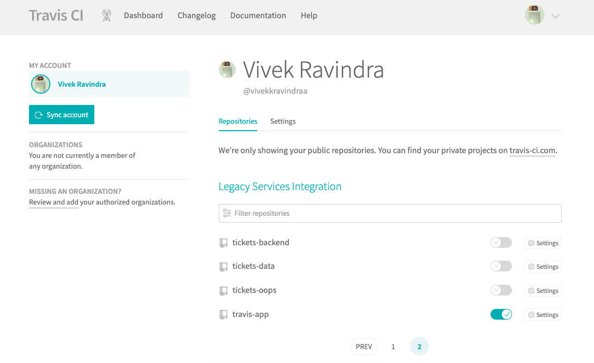

This project was bootstrapped with [Create React App](https://github.com/facebook/create-react-app).

## Creating Our First React App

[](https://travis-ci.org/vivekkravindraa/travis-app)

First, start off by moving into wherever you want to develop your application. In that directory, we’re going to create an app called “travis-app”:

    $ npx create-react-app travis-app

    $ cd travis-app

    $ npm start

This will start up a little development web server and give you a place to start working on your application. Running this will start up a development server at http://localhost:3000/ and give you a nice little starter template:


    $ npm run build

    $ test

    $ npm run eject

## Setting up Continuous Integration Builds

First, make sure your react project is pushed into the GitHub and you have an account in TravisCI.

The very first step in integrating Travis CI is to create a file named .travis.yml which will contain the essential information about the environment and configurations for the build to run. For simplicity, we will just include the programming environment and the version. In our simple project, it is NodeJS version will be set to stable and also the node version will be mentioned. You can check by your current node version by running <code>node -v</code>.

The final contents of the file .travis.yml will be as follows:

/.travis.yml

```ruby
language: node_js
node_js:
- "stable"
cache:
directories:
- node_modules
script:
- npm test
- npm run build
```

We will add this file in our project root folder like this and push it to our github repository.


In order to make this build file working, we need to link up our project to Travis. For that, we can go to our logged in account in Travis.



And then click the + icon near to the My Repositories which will open a new window.


Then toggle the settings to enable the project. It will start the build process.

## Setting up auto deployment to GitHub Pages

In order to deploy to the github pages, we need to provide access_token to our build file. To obtain a new access_token we can go to.

Settings > Developer Settings > Personal Access Tokens

Add Token Description ex: travis-app

Select Scopes by ticking the checkbox "repo"


About permission, we need repo level access.

Copy the value of this token. This is a private token that gives access to your GitHub repos.

Now we can go to our project build screen. Then navigate to the settings page and add the environment variables and paste the copied token as its value. Here I have named my variable as github_token.


To make our deployment work we need to add deployment script in our .travis.yml. Now, let's add it.

/.travis.yml

```ruby
language: node_js
node_js:
- "stable"
cache:
directories:
- node_modules
script:
- npm test
- npm run build

deploy:
provider: pages
skip_cleanup: true
github_token: $github_token
local_dir: build
on:
    branch: master
```

Here, $github_token will read the access token value from our environment variables that we set previously.

We need to let our app know which URL that it should look for. We can set the URL in our app package.json. In my case, it goes like..

```javascript
{
    "name": "travis-app",
    "version": "0.1.0",
    "private": true,
    "homepage": "https://vivekkravindraa.github.io/travis-app/",
    "dependencies": {
        ........
    }, 
    ....
}
```

It could vary on others but the format is like this.

    https://<usename>.github.io/<repository_name>/

Now, we can commit and push our changes to our repo in Github. It will automatically trigger the build. After successful completion of our build, it will deploy our project into the gh-pages. Thus resulting our app running in the URL which in my case is:

    Travis App

    vivekkravindraa.github.io

[Travis App CI Build](src/images/travis-app-ci-build.png)

# Adding Build Passing to README.md

[Build Passing](src/images/travis-build-passing.png)

## Available Scripts

In the project directory, you can run:

### `npm start`

Runs the app in the development mode.<br>
Open [http://localhost:3000](http://localhost:3000) to view it in the browser.

The page will reload if you make edits.<br>
You will also see any lint errors in the console.

### `npm test`

Launches the test runner in the interactive watch mode.<br>
See the section about [running tests](https://facebook.github.io/create-react-app/docs/running-tests) for more information.

### `npm run build`

Builds the app for production to the `build` folder.<br>
It correctly bundles React in production mode and optimizes the build for the best performance.

The build is minified and the filenames include the hashes.<br>
Your app is ready to be deployed!

See the section about [deployment](https://facebook.github.io/create-react-app/docs/deployment) for more information.

### `npm run eject`

**Note: this is a one-way operation. Once you `eject`, you can’t go back!**

If you aren’t satisfied with the build tool and configuration choices, you can `eject` at any time. This command will remove the single build dependency from your project.

Instead, it will copy all the configuration files and the transitive dependencies (Webpack, Babel, ESLint, etc) right into your project so you have full control over them. All of the commands except `eject` will still work, but they will point to the copied scripts so you can tweak them. At this point you’re on your own.

You don’t have to ever use `eject`. The curated feature set is suitable for small and middle deployments, and you shouldn’t feel obligated to use this feature. However we understand that this tool wouldn’t be useful if you couldn’t customize it when you are ready for it.

## Learn More

You can learn more in the [Create React App documentation](https://facebook.github.io/create-react-app/docs/getting-started).

To learn React, check out the [React documentation](https://reactjs.org/).

### Code Splitting

This section has moved here: https://facebook.github.io/create-react-app/docs/code-splitting

### Analyzing the Bundle Size

This section has moved here: https://facebook.github.io/create-react-app/docs/analyzing-the-bundle-size

### Making a Progressive Web App

This section has moved here: https://facebook.github.io/create-react-app/docs/making-a-progressive-web-app

### Advanced Configuration

This section has moved here: https://facebook.github.io/create-react-app/docs/advanced-configuration

### Deployment

This section has moved here: https://facebook.github.io/create-react-app/docs/deployment

### `npm run build` fails to minify

This section has moved here: https://facebook.github.io/create-react-app/docs/troubleshooting#npm-run-build-fails-to-minify
